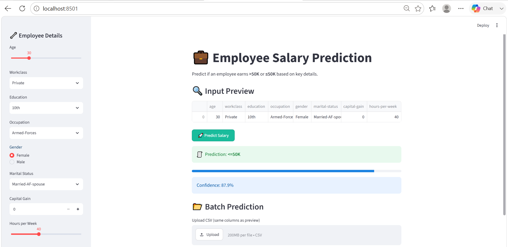

# 💼 Employee Salary Prediction

A Machine Learning web application that predicts whether an employee is likely to earn **more than $50K** or **$50K or less** per year based on demographic and employment-related information.

The application is built using **Python**, **Streamlit**, and **Scikit-learn**, providing an intuitive interface for both individual and batch salary predictions.

---

## 📌 Project Overview

Employee salary prediction is a binary classification problem in Machine Learning. This project uses a trained classification model to analyze employee details such as age, education, occupation, workclass, gender, marital status, capital gain, and weekly working hours to predict the income category.

The application offers:

- Single employee salary prediction
- Confidence score for predictions
- Batch prediction using CSV files
- Downloadable prediction results
- Clean and interactive Streamlit interface

---

## 🚀 Features

- Interactive and responsive Streamlit UI
- Real-time salary prediction
- Confidence score display
- Batch prediction through CSV upload
- Download prediction results as CSV
- Encoded categorical feature handling
- User-friendly input preview

---

## 🛠️ Tech Stack

### Programming Language
- Python

### Machine Learning
- Scikit-learn
- Pandas
- NumPy

### Web Framework
- Streamlit

### Model Serialization
- Pickle

---

## 📂 Project Structure

```
Employee-Salary-Prediction/
│
├── app.py
├── model.pkl
├── encoders.pkl
├── columns.pkl
├── target_encoder.pkl

├── README.md
└── screenshots/
    └── home.png
```

---

## ⚙️ Installation

### 1. Clone the repository

```bash
git clonehttps://github.com/rishirajtiwari1608-png/employee-salary-predication.git
```

---

### 2. Navigate to the project

```bash
cd Employee-Salary-Prediction
```

---

### 3. Create a virtual environment

Windows

```bash
python -m venv env
```

Activate it

```bash
env\Scripts\activate
```

---

### 4. Install dependencies

```bash
pip install -r requirements.txt
```

---

### 5. Run the application

```bash
streamlit run app.py
```

The application will open automatically in your browser.

---

## 📊 Input Features

The model uses the following features:

| Feature | Description |
|----------|-------------|
| Age | Employee age |
| Workclass | Employment type |
| Education | Highest education level |
| Occupation | Job category |
| Gender | Male/Female |
| Marital Status | Marital status |
| Capital Gain | Annual capital gain |
| Hours per Week | Weekly working hours |

---

## 📈 Output

The application predicts:

- **>50K**
- **<=50K**

It also displays:

- Prediction confidence
- Probability score
- Input preview

---

## 📂 Batch Prediction

You can upload a CSV file containing multiple employee records.

After prediction:

- View the results instantly
- Download the output CSV with predicted salary labels

---

## 📸 Screenshots

### Home Page




---

## 📦 Requirements

Example:

```
streamlit
pandas
numpy
scikit-learn
```

Generate automatically using:

```bash
pip freeze > requirements.txt
```

---

## 🎯 Future Improvements

- Support additional employee attributes
- Model comparison dashboard
- Feature importance visualization
- Dark mode UI
- Cloud deployment
- REST API integration
- User authentication

---

## 🤝 Contributing

Contributions are welcome.

1. Fork the repository
2. Create a new branch

```bash
git checkout -b feature-name
```

3. Commit your changes

```bash
git commit -m "Add new feature"
```

4. Push to GitHub

```bash
git push origin feature-name
```

5. Open a Pull Request

---

## 👨‍💻 Author

**Aman Tiwari**

Computer Science Engineering Student

GitHub:https://github.com/rishirajtiwari1608-png


---

## ⭐ Support

If you found this project useful, consider giving it a ⭐ on GitHub. It helps others discover the project and motivates further development.

---

## 📄 License

This project is intended for educational and learning purposes.

Feel free to use, modify, and improve it.